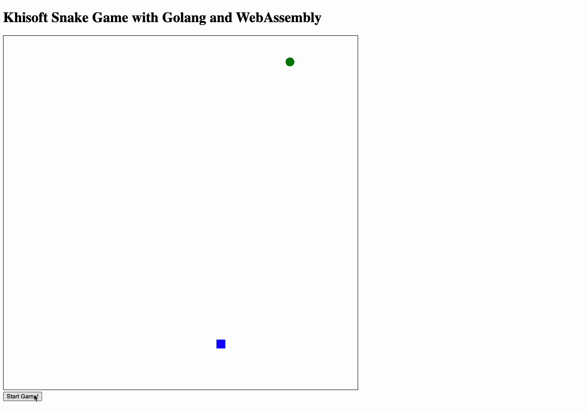

# Khisoft Snake Game with Golang and WebAssembly

## How to run

just run with command make all

## Project Structure

|\_**\_go.mod  
|\_\_**server.go -> to run static web with golang http  
|\_**\_makefile -> all magic is here, just run make compile, make run, make all  
|\_\_**wasm -> golang wasm directory project  
| |\_**\_main.go  
|\_\_**readme.md -> guide this project  
|\_**\_.gitignore  
|\_\_**static -> static web frontend  
| |\_**\_index.html -> frontend view call wasm in js  
| |\_\_**wasm_exec.js -> lib wasm  
| |\_**\_main.wasm -> compile result from wasm dir project  
|\_\_**.vscode  
| |\_**\_settings.json -> just config vscode  
| |\_\_**extensions.json -> some with above, but this is for extension
